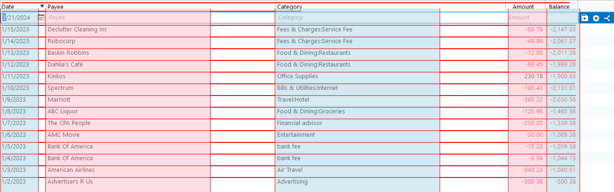

# Reading table content from an image (OCR)

Repository containing solution to read table-like information from an image using the definitions of `headers` and `columns`.

The OCR related configuration options are described in the [configuration.py](src/configuration.py) file.

The image preprocessing methods are implemented in the [preprocess.py](src/preprocess.py) file.

The Medium [article](https://medium.com/@mika.hanninen/reading-table-content-from-an-image-with-local-ocr-solution-027b0cf436d2) describes the approach in this repository.

- Main task in [tasks.py](tasks.py)
- Robot configuration in [robot.yaml](robot.yaml)
- Robot dependencies in [conda.yaml](conda.yaml)
- Library implementing `ocr_table()` method in [OCRLibrary.py](src/OCRLibrary.py)

## Learning materials

- [Robocorp Developer Training Courses](https://robocorp.com/docs/courses)
- [Documentation links on Robot Framework](https://robocorp.com/docs/languages-and-frameworks/robot-framework)
- [Example bots in Robocorp Portal](https://robocorp.com/portal)
